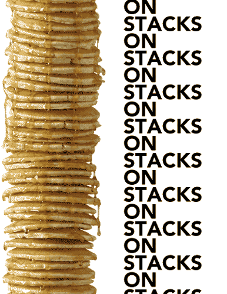

# File Encryption and Decryption (HTML, CSS, JavaScript):

## Table of Contents:

- [Introduction](#introduction)
- [What I Learnt](#what-i-learnt)
  - [Client Side Encryption](#client-side-encryption)
  - ['Bower' Package Manager Error](#bower-package-manager-error)
  - [The Importance of Frameworks & Technologies](#the-importance-of-frameworks--technologies)
- [Conclusion](#conclusion)

## Introduction:

- A simple file encryption and decryption app. A personal project that is a variation of [this project](https://github.com/nadupoy/File-Encryption-and-Decryption).

- Tools and technologies used are:
  - HTML
  - CSS
  - Vanilla JavaScript
  - [Vite](https://vitejs.dev/)
  - Visual Studio Code
  - [Crypto JS](https://github.com/brix/crypto-js?utm_source=cdnjs&utm_medium=cdnjs_link&utm_campaign=cdnjs_library)
  - [Bower](https://bower.io/)

## What I Learnt:

### Client Side Encryption:

- I found [this](https://www.internetsafetystatistics.com/javascript-encryption-guide/) article by [Internet Safety Statistics](https://www.internetsafetystatistics.com/) to be a comprehensive introduction to encryption using JavaScript, particularly on the client side.

- Initially, I had planned to write my own encryption and decryption function(s) (i.e. algorithms), but it didn't take long for me to realise that I had bitten off more than I could chew, resulting in unnecessary and avoidable frustration. 😅

- There are JavaScript libraries for this purpose such as [CryptoJS](https://cdnjs.com/libraries/crypto-js). [Kinsta.com](https://kinsta.com/blog/javascript-libraries/) also has an article on some \*popular JavaScript libraries.

- I was also introduced to **AES (Advanced Encryption Standard)** and **RSA (Rivest-Shamir-Adleman)**, two robust and well-established cryptographic algorithms. <br/>
  I am eager to learn more about them and algorithms in general. 👩🏽‍🏫

**_N/B:_** [This](https://www.internetsafetystatistics.com/common-encryption-methods/) article is of interest to me. I thought to include it here for future reference. 🔍

### 'Bower' Package Manager Error:

- After installing [Bower](https://bower.io/), I encountered the following error in the command terminal when trying to install [Crypto JS](https://github.com/brix/crypto-js?utm_source=cdnjs&utm_medium=cdnjs_link&utm_campaign=cdnjs_library):

```
'bower' is not recognized as an internal or external command, operable program or batch file.
```

- Installing Bower without using the 'g' flag seems to have resulted in this error.
  <br/>
  Re-installation using the 'g' flag fixed the error.

### The Importance of Frameworks & Technologies:

- I am now seeing the importance and logic behind tools like React and Node.js.
  <br/>
  Building a project from scratch using HTML, CSS and Vanilla JavaScript can get complicated. I ended up encountering quite a number of errors building this way.
  <br/>
  These are the latest errors I encountered on my browser console:

```
Uncaught SyntaxError: import not found: default main.js:3:8
```

```
Uncaught TypeError: root is undefined
    <anonymous> crypto-js.js:12
    <anonymous> crypto-js.js:14
crypto-js.js:12:18
```

- Using packages on the frontend without Node.js has honestly proven to be quite the challenge for me. I am seeing the sense in a tool like Node.js with its built-in modules such as the [Crypto Module](https://www.w3schools.com/nodejs/ref_crypto.asp), which is best suited for this case.
  <br/>
  With React, one can built the front-end purely in JavaScript or JSX.
  <br/>
  I now see the sense in these technologies from a practical and experiential point of view and not merely a theoretical one. (Talk about a baptism by fire. 🔥 😅)

## Conclusion:

- With that said, it makes practical sense to take a different approach to this project. Therefore I'm leaving this at that . . . for now at least. 🛫

- Consequently, I intend to go fullstack with this project using React and Node.js.<br/>
  
